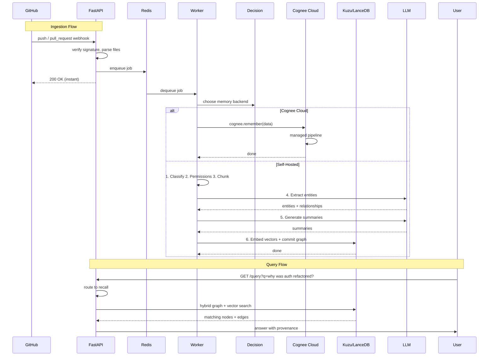
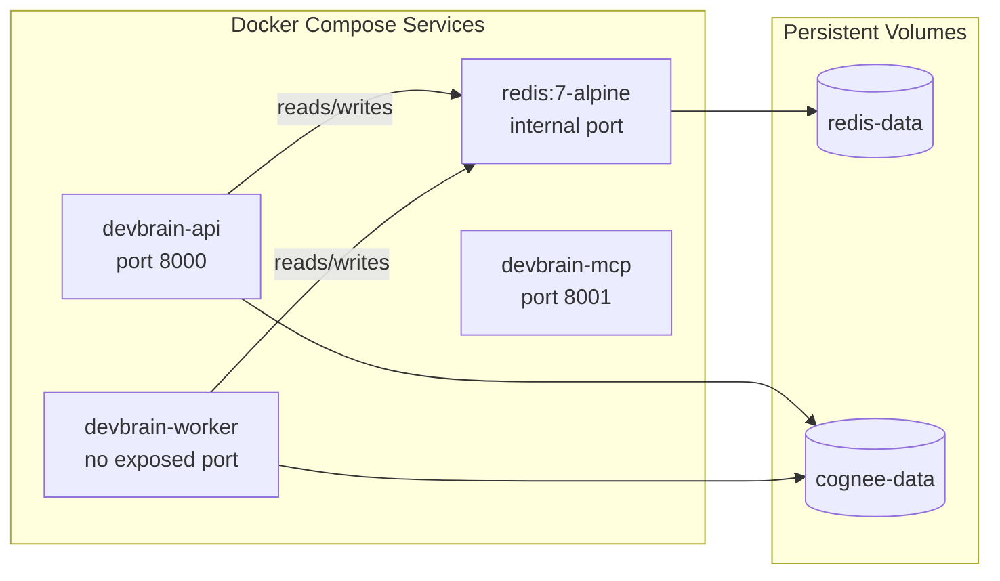
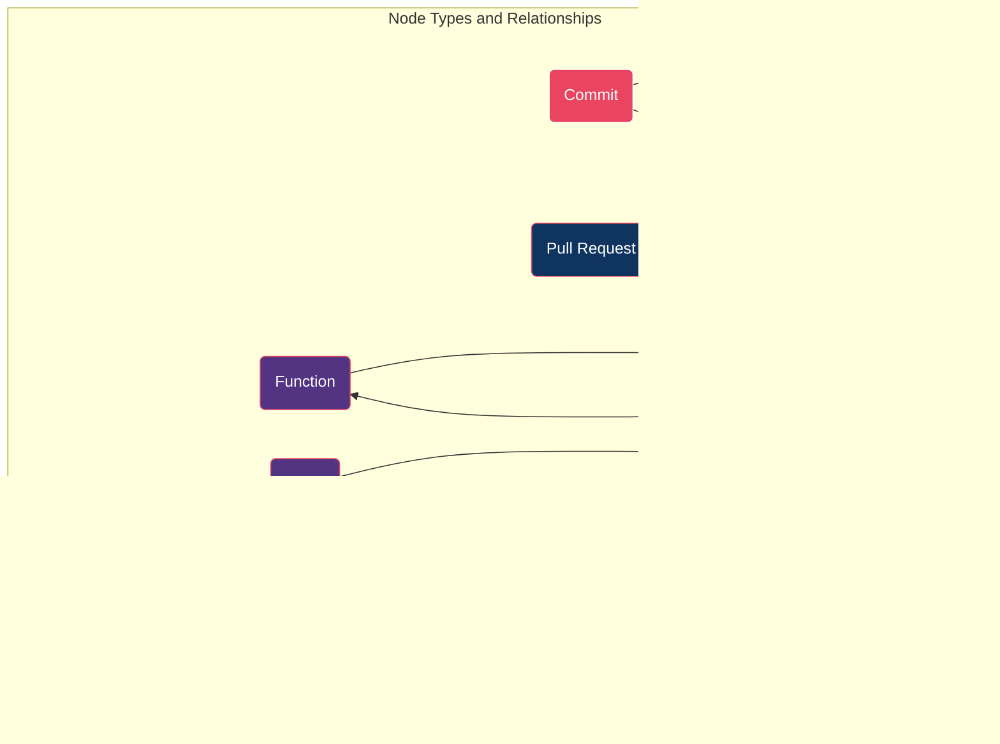

# DevBrain System Design & Architecture

## Architecture Overview

```mermaid
flowchart LR
  classDef source fill:#1a1a2e,stroke:#e94560,stroke-width:2,color:#fff
  classDef ingest fill:#16213e,stroke:#0f3460,stroke-width:2,color:#fff
  classDef cloud fill:#1b4332,stroke:#52b788,stroke-width:2,color:#fff
  classDef self fill:#2d2d2d,stroke:#e9c46a,stroke-width:2,color:#fff
  classDef query fill:#3d1e6d,stroke:#e94560,stroke-width:2,color:#fff
  classDef output fill:#e94560,stroke:#fff,stroke-width:2,color:#fff
  classDef agent fill:#0f3460,stroke:#53b7e8,stroke-width:2,color:#fff
  classDef external fill:#333,stroke:#777,stroke-width:1,color:#999

  subgraph Inputs[Inputs]
    GH[GitHub Repository<br/>Commits, PRs, Issues, Releases]
    ADR[Architecture Decision Records]
    AST[Code AST via cognee codegraph]
  end

  subgraph Server[DevBrain Server - Docker Compose]
    API[FastAPI Server<br/>REST API + Webhook]
    RDS[Redis<br/>Job Queue + Profiles<br/>+ Changelog State]
    WKR[ARQ Worker<br/>Background Ingestion]
  end

  subgraph CloudPath[Cognee Cloud Path]
    COG[COGNEE CLOUD<br/>Managed Graph + Vector<br/>No local infra needed<br/>Sign up at cognee.ai<br/>Code: COGNEE-35]
    CDOC[Profile Documents<br/>Mentions + File Touches<br/>NL-queryable]
  end

  subgraph SelfPath[Open-Source Cognee Path]
    KUZU[KUZU / NEO4J<br/>Graph Store<br/>AST nodes, Call Graphs,<br/>PR/Commit connections]
    LANCE[LANCEDB<br/>Vector Store<br/>Semantic embeddings<br/>for fuzzy matching]
    SQL[SQLITE<br/>Relational Store<br/>System state<br/>and mappings]
  end

  subgraph Recall[Query Processing]
    HY[Hybrid Router<br/>Vector + Graph combined]
    GR[Graph Completion<br/>Multi-hop traversal]
    CH[Chunk Retrieval<br/>Raw text matches]
  end

  subgraph Frontend[User Interfaces]
    REST[REST API<br/>/query, /ingest, /changelog, /git]
    UI[Web UI<br/>React + D3.js<br/>Force-directed graph]
    MCP[Cognee MCP Server<br/>MCP protocol bridge]
  end

  subgraph Agents[AI Coding Agents]
    CC[Claude Code]
    CR[Cursor IDE]
    OC[OpenCode]
  end

  subgraph ExternalServices[External]
    LLM[LLM Provider<br/>OpenAI / Anthropic]
    GHAPI[GitHub API]
  end

  GH -.->|push, pull_request| API
  ADR -.->|/ingest endpoint| API
  AST -.->|/ingest endpoint| API
  API -->|enqueue| RDS
  RDS -->|dequeue| WKR
  API -->|fetch diffs, reviews| GHAPI

  WKR -->|CHOICE| Decision{Choose Memory Backend}
  Decision -->|COGNEE CLOUD| COG
  Decision -->|SELF-HOSTED| SelfPath

  COG --> CDOC

  subgraph SelfECL[6-Stage ECL Pipeline]
    S1[1. Classify]
    S2[2. Permissions]
    S3[3. Chunk]
    S4[4. LLM Extract Entities]
    S5[5. Generate Summaries]
    S6[6. Embed and Commit]
  end

  SelfPath -.- S1
  S1 --> S2 --> S3 --> S4 --> S5 --> S6
  S4 -->|extraction| LLM
  S5 -->|summarization| LLM
  S6 --> KUZU
  S6 --> LANCE
  S6 --> SQL

  KUZU --> HY
  LANCE --> HY
  SQL --> HY
  KUZU -->|deep traversal| GR
  LANCE -->|semantic search| CH

  COG -.->|managed query| HY
  COG -.->|managed query| GR

  HY --> REST
  GR --> REST
  CH --> REST

  REST --> UI
  REST --> MCP
  UI -->|browser| DEV[Developer]
  REST -->|curl| DEV

  MCP --> CC
  MCP --> CR
  MCP --> OC

  API -.->|cognee.recall| HY
  API -.->|cognee.recall| GR
  WKR -.->|cognee.improve weekly| S4
  WKR -.->|cognee.forget module| KUZU
```

## Data Flow Summary

```mermaid
sequenceDiagram
  participant GH as GitHub
  participant API as FastAPI
  participant R as Redis
  participant W as Worker
  participant D as Decision
  participant C as Cognee Cloud
  participant K as Kuzu/LanceDB
  participant L as LLM
  participant U as User

  Note over GH,API: Ingestion Flow
  GH->>API: push / pull_request webhook
  API->>API: verify signature, parse files
  API->>R: enqueue job
  API-->>GH: 200 OK (instant)

  R->>W: dequeue job
  W->>D: choose memory backend

  alt Cognee Cloud
    W->>C: cognee.remember(data)
    C->>C: managed pipeline
    C-->>W: done
  else Self-Hosted
    W->>W: 1. Classify 2. Permissions 3. Chunk
    W->>L: 4. Extract entities
    L-->>W: entities + relationships
    W->>L: 5. Generate summaries
    L-->>W: summaries
    W->>K: 6. Embed vectors + commit graph
    K-->>W: done
  end

  Note over API,U: Query Flow
  U->>API: GET /query?q=why was auth refactored?
  API->>API: route to recall
  API->>K: hybrid graph + vector search
  K-->>API: matching nodes + edges
  API->>U: answer with provenance
```

## Docker Services

```mermaid
graph LR
  subgraph Docker[Docker Compose Services]
    RD[redis:7-alpine<br/>internal port]
    API[devbrain-api<br/>port 8000]
    WK[devbrain-worker<br/>no exposed port]
    MCP[devbrain-mcp<br/>port 8001]
  end

  subgraph Volumes[Persistent Volumes]
    RDV[(redis-data)]
    COGV[(cognee-data)]
  end

  API -->|reads/writes| RD
  RD --> RDV
  WK -->|reads/writes| RD
  API --> COGV
  WK --> COGV
```

## Graph Schema

```mermaid
graph TB
  classDef commit fill:#e94560,stroke:#fff,color:#fff
  classDef pr fill:#0f3460,stroke:#e94560,color:#fff
  classDef code fill:#533483,stroke:#e94560,color:#fff
  classDef adr fill:#2d6a4f,stroke:#52b788,color:#fff
  classDef edge fill:none,stroke:#666,color:#999

  subgraph Nodes[Node Types and Relationships]
    C(Commit):::commit
    PR(Pull Request):::pr
    I(Issue):::pr
    D(Developer):::code
    F(File):::code
    FN(Function):::code
    CL(Class):::code
    M(Module):::code
    A(ADR):::adr
    R(Release):::adr
  end

  C -->|MODIFIED| F
  C -->|AUTHORED_BY| D
  PR -->|CHANGED| F
  PR -->|MOTIVATED_BY| I
  PR -->|APPROVED_BY| D
  FN -->|CALLS| FN
  CL -->|INHERITS| CL
  M -->|DEPENDS_ON| M
  A -->|JUSTIFIES| M
  A -->|SUPERSEDES| A
```
