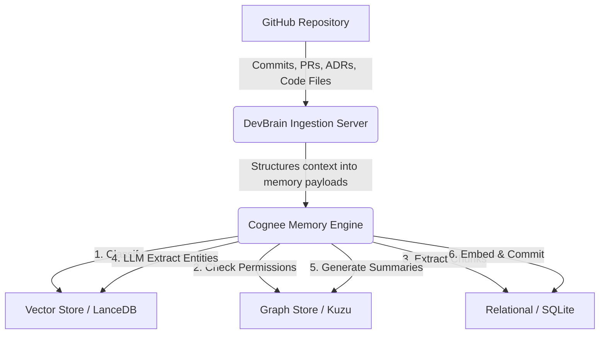

DevBrain is built on a **six-stage ECL pipeline** powered by Cognee's hybrid graph-vector memory layer.

## High-Level Flow

## Cognee 6-Stage ECL Pipeline

1. **Classify** - categorize incoming documents by type
2. **Check permissions** - enforce access controls
3. **Extract chunks** - split documents into processable segments
4. **LLM extract** - identify entities and relationships from text
5. **Generate summaries** - create concise document summaries
6. **Embed & commit** - vectorize and store in all three stores

## Three-Store Architecture

<TypeTable
  type={{
    Graph: { type: "Kuzu / Neo4j", description: "AST nodes, call graphs, PR/commit connections" },
    Vector: { type: "LanceDB", description: "Semantic search and fuzzy concept matching" },
    Relational: { type: "SQLite", description: "System state and mappings" },
  }}
/>

## Services

<TypeTable
  type={{
    FastAPI: { type: "Service", description: "REST API + webhook receiver" },
    "ARQ Worker": { type: "Service", description: "Background Cognee ingestion jobs" },
    Redis: { type: "Service", description: "Job queue + changelog/profile state" },
    "Cognee MCP": { type: "Service", description: "Agent interface for Claude Code, Cursor" },
  }}
/>
