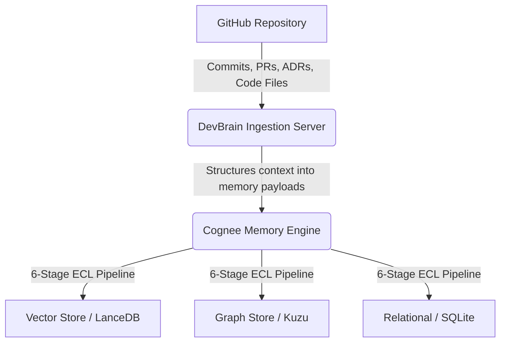

# DevBrain

**DevBrain** solves institutional knowledge loss — the "why was this changed?" problem that every engineering team faces. It captures not just what the code looks like, but why it became what it is, and makes that knowledge permanently queryable by both humans and AI coding agents.

### Core Capability

Ask anything about your codebase's history. Get sourced answers, not guesses, with full provenance back to the original PR, commit, or ADR.

---

## Memory Architecture

DevBrain uses **Cognee's hybrid graph-vector memory layer**. Every piece of engineering knowledge lives in one of three stores, and all three are queried simultaneously at recall time:

1. **Graph Store (Kuzu/Neo4j):** Houses deep AST (Abstract Syntax Tree) nodes and relationships, call graphs, import dependencies, and PR/commit connections.
2. **Vector Store (LanceDB):** Performs semantic/fuzzy matching for concepts and queries.
3. **Relational Store (SQLite):** Maintains system state and mappings.

---

## Next Steps

Explore the rest of the documentation to get started:

- [Getting Started / Setup](./setup)
- [REST API Reference](./api)
- [Changelog & Profiles](./changelog-system)
