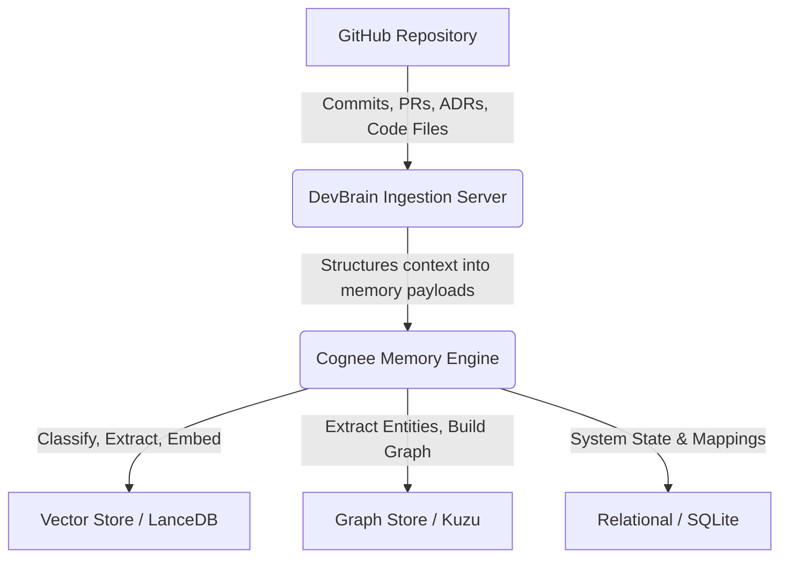

**DevBrain** is a living engineering memory that captures not just what your code does, but why it became what it is.

Every engineering team knows the pain: a critical module was refactored six months ago, the original author has moved teams, and the PR description says "improved performance." DevBrain solves this by connecting commits, PR discussions, review comments, ADRs, and code structure into a queryable knowledge graph - accessible to both humans and AI agents.

---

## How It Works

DevBrain ingests your GitHub repository's full context - every commit, PR, review comment, architecture decision, and code structure - and stores it in Cognee's hybrid graph-vector memory. You can then ask natural language questions and get sourced answers with provenance back to the original PR, commit, or ADR.

<Callout type="info" title="Key capability">
Ask anything about your codebase's history. Get sourced answers - not guesses - with full provenance.
</Callout>

---

## Why It Matters

### For Engineers
Stop spelunking through git blame and Slack history. Ask "why was this module structured this way?" and get an answer rooted in actual decisions.

### For Onboarding
New team members go from "where do I start?" to "I understand the rationale behind this architecture" in minutes instead of weeks.

### For AI Agents
Claude Code, Cursor, OpenCode - any MCP-compatible agent queries DevBrain automatically during coding sessions, surfacing relevant historical context alongside code suggestions.

---

## The Memory Architecture

Every piece of engineering knowledge lives in three stores, queried simultaneously at recall time:

<TypeTable
  type={{
    "Graph Store": { type: "Kuzu / Neo4j", description: "AST nodes, call graphs, import dependencies, PR/commit relationships" },
    "Vector Store": { type: "LanceDB", description: "Semantic search and fuzzy concept matching for natural language queries" },
    "Relational Store": { type: "SQLite", description: "System state, mappings, and metadata" },
  }}
/>

---

## Deployment Modes

DevBrain runs on Cognee, which supports two deployment modes:

<Cards>
  <Card
    title="Cognee Cloud"
    description="Hosted graph, vector, and relational stores. No local infrastructure needed beyond the ingestion server. Recommended for most users."
  />
  <Card
    title="Local Mode"
    description="File-based Kuzu (graph) + LanceDB (vector) + SQLite (relational). LLM via Gemini API. No cloud dependency. Ideal for air-gapped environments."
  />
</Cards>

The backend auto-detects the mode: set `COGNEE_API_KEY` for cloud, leave it blank for local. All features work identically in both modes. See the [Setup & Deployment](./setup) pages for configuration details.

---

## Documentation Sections

<Cards>
  <Card title="Quickstart" description="Get running in under 5 minutes" href="./quickstart" />
  <Card title="Setup & Deployment" description="Docker, local setup, and configuration" href="./setup" />
  <Card title="Guides" description="Ingestion, webhooks, and changelog digests" href="./guides" />
  <Card title="AI Agents" description="Connect Claude Code, Cursor, or OpenCode" href="./agents" />
  <Card title="API Reference" description="Full REST API endpoint documentation" href="./api" />
  <Card title="Architecture" description="System design and graph schema" href="./architecture" />
  <Card title="FAQ" description="Frequently asked questions" href="./faq" />
</Cards>
